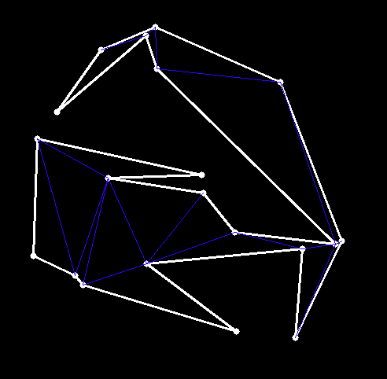
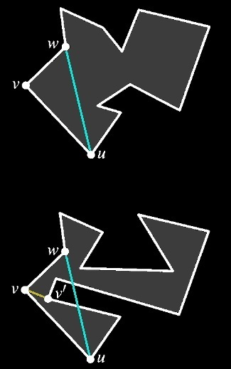

# Triangulation

    
    

The algorithm for triangulating an arbitrary simple polygon has been implemented. The algorithm is based on proving the theorem of the existence of a polygon's triangulation[1].

`CGAL` objects were used as primitives. Illustrations were made using `OpenCV`.

-----
1. Mark de Berg, Marc van Kreveld, Mark Overmars, and Otfried Schwarzkopf (2000), Computational Geometry (2nd revised ed.), Springer-Verlag, ISBN 3-540-65620-0 Chapter 3: Polygon Triangulation: pp.45–61.